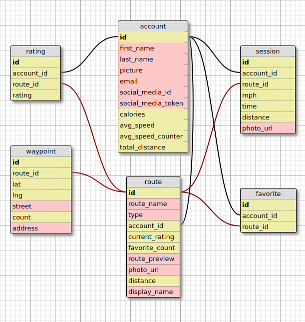
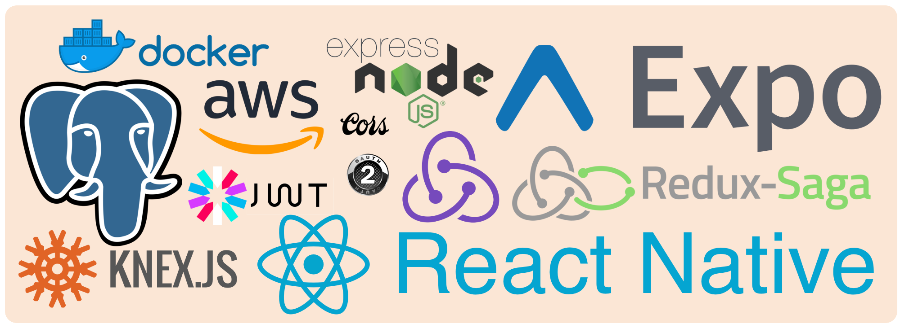

# bikeMap

## Database

## Tech Stack 

## Server Environmental Variables

### Proxy Server
  - PORT="YOUR PORT HERE"
  - API_URL=http://api:3000
  - AUTH_URL=http://auth:3000

### Database Server
  - PORT="YOUR PORT HERE"
  - DB_HOST="DATABASE URL"
  - DB_PORT="DATABASE PORT"
  - DB_USER="DATABASE USER"
  - DB_PASS="DATABASE PASSWORD"
  - DB_DATABASE="DATABASE NAME"
  - SECRET="YOUR SUPER SECURE SECRET:
  - AUDIENCE=cyclists
  - ISSUER="UP TO YOU"

### Authentication Server
  - PORT="YOUR PORT HERE"
  - FB_SECRET="FACEBOOK SECRET"
  - FB_APP_ID="YOUR APP ID"